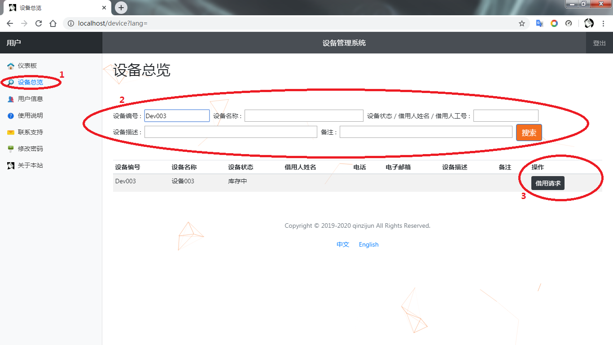
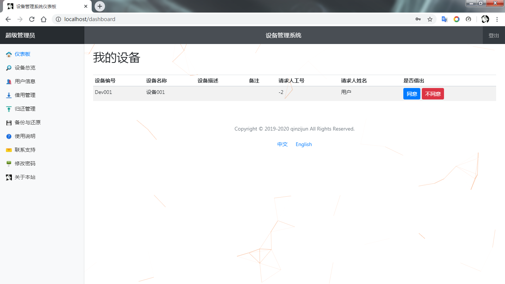
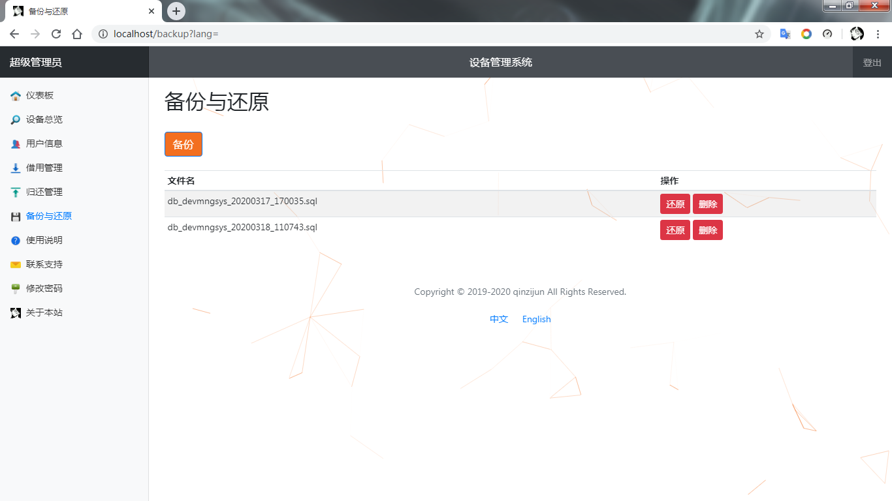
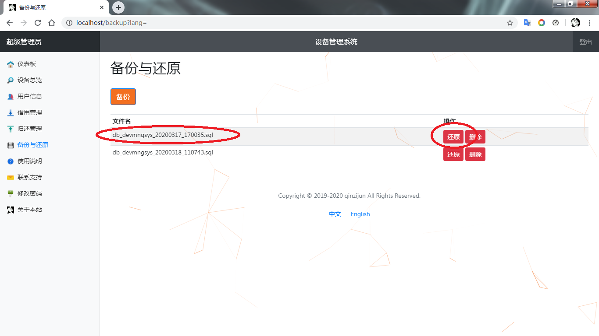
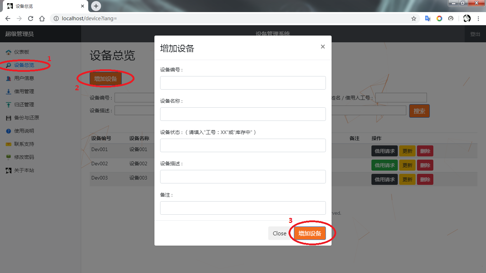
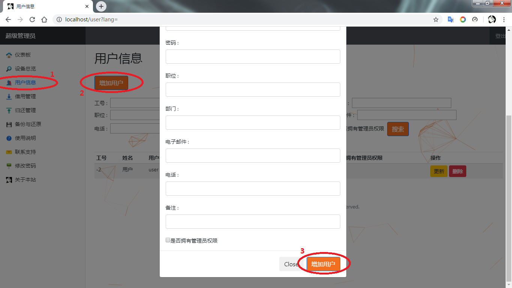
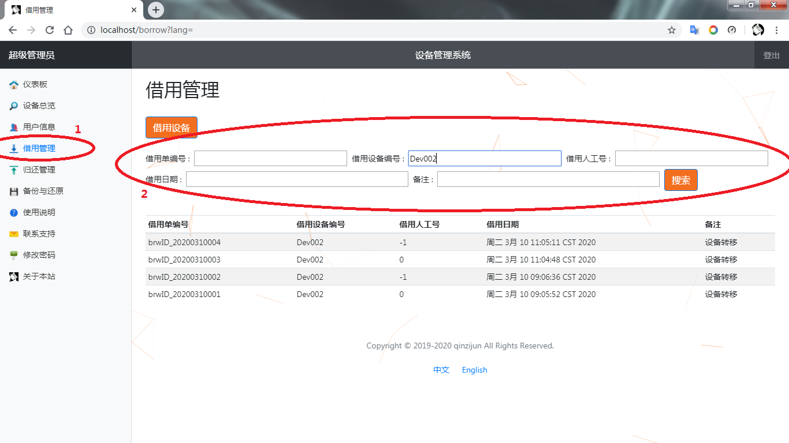
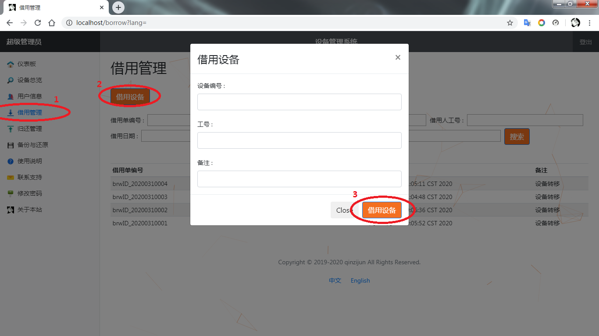

---

---

# DevMngSysWeb
企业设备管理系统网页版

C/S version of https://github.com/blingbling-110/DevMngSys

- [ 一般用户](#head1)
  - [ 查询设备状态](#head2)
    - [ 借用设备](#head3)
    - [ 发送借用请求](#head4)
  - [ 同意/拒绝借用请求](#head5)
  - [ 归还设备](#head6)
  - [ 修改密码](#head7)
- [ 管理员用户](#head8)
  - [ 备份数据库](#head9)
  - [ 恢复数据库](#head10)
  - [ 增加/更新/删除设备](#head11)
  - [ 增加/更新/删除人员](#head12)
  - [ 借用/归还管理](#head13)
    - [ 搜索借用单](#head14)
    - [ 填写借用单](#head15)
    - [ 搜索归还单](#head16)
    - [ 填写归还单](#head17)

#  一般用户

一般用户即使用本系统的大部分用户，可以查看欲借用设备的当前状态、对已被他人借用的设备发送借用请求等，而不需要对系统进行操作。下面对一般用户操作进行详细描述：

##  查询设备状态

单击导航栏中的“设备总览”进入搜索窗口：

输入设备编号或其他信息（支持模糊搜索），单击搜索即可查看符合搜索条件设备的当前状态。

###  借用设备

若显示“库存中”，则表明此设备未被借出，需要联系设备管理员借用并提供设备编号及工号；否则请参考“发送借用请求”。

###  发送借用请求

若显示“工号：*”，则表明此设备已被工号为\*的同事借用，并且可以查看该同事的姓名、电话、邮箱信息。单击“借用请求”按钮（）向该同事发送借用请求，发送成功之后即可联系该同事借用设备。

##  同意/拒绝借用请求

在借用设备之后您便拥有了防止设备损坏、避免设备丢失的责任和义务，表现在本系统中即为在其他同事联系您借用该设备时需要同意/拒绝其借用请求，具体操作如下。

在其他同事联系您之后，登录本系统并会在仪表板中收到设备请求：

若您确定已将此设备借给这位同事，请单击“同意”按钮，这就完成了设备转移。

若您无法将此设备借给这位同事并确认设备还在自己手上，您需要单击“不同意”按钮来拒绝其借用请求。

##  归还设备

归还设备不需要直接在系统中进行操作，但需要联系管理员归还并提供设备编号以及工号。

##  修改密码

单击导航栏中的“修改密码”进入修改密码模态框：

输入原密码、新密码并确认密码即可。

#  管理员用户

管理员用户即设备管理员兼系统维护人员，除了一般用户所能进行的操作之外，还需要对设备的进出库进行管理、适时对数据库进行本地备份以维护数据安全。下面对管理员用户独有的操作进行详细描述：

##  备份数据库

为了数据安全，管理员应适时在本地备份数据库。单击导航栏中的“备份与还原”进入数据库备份与还原页面：

单击左上角“备份”按钮即可在程序文件夹中的backup文件夹下备份数据库，并且备份文件以数据库名称和当前时间命名以便日后恢复数据库时识别。

##  恢复数据库

单击导航栏中的“备份与还原”进入数据库备份与还原页面：

单击欲还原数据库文件的“还原”按钮即可恢复数据库。

##  增加/更新/删除设备

单击导航栏中的“设备总览”进入设备总览页面：

单击左上角的“增加设备”按钮，并在模态框中输入设备信息，单击“增加设备”按钮即可。

若需要更新/删除设备，只须在表格中单击欲更新/删除设备的"更新"/“删除”按钮。

##  增加/更新/删除人员

单击导航栏中的“用户信息”进入用户信息页面：

单击左上角的“增加用户”按钮，并在模态框中输入用户信息，单击“增加用户”按钮即可。

若需要更新/删除人员，只须在表格中单击欲更新/删除人员的"更新"/“删除”按钮。

##  借用/归还管理

管理员可以搜索/填写所有借用单、归还单，由于其为镜像，故下面以借用单为例描述如何进行操作：

###  搜索借用单

单击导航栏中的“借用管理”进入借用单页面：

默认将倒序显示所有借用单信息，在各搜索文本框中输入搜索信息（支持模糊搜索），并单击“搜索”按钮即可进行借用单搜索。

###  填写借用单

若一般用户需要借用库存中的设备，则需要联系您并提供设备编号及其工号。

单击借用管理页面左上角的“借用设备”按钮，弹出借用设备模态框

将借用信息输入模态框中后单击“借用设备”按钮即可。

###  搜索归还单

具体操作可参考“搜索借用单”。

###  填写归还单

若一般用户需要归还设备至库存中，则需要联系您并提供设备编号及其工号。具体操作可参考“填写借用单”。

